____

# TP 1 : Workflow Git & Qualité du Code

## 1/ Règles Git

Ce projet suit un workflow structuré pour garantir un historique propre et un développement collaboratif efficace.

### Branches principales
- `main` → version stable et prête au déploiement  
- `develop` → environnement d’intégration, reçoit les fonctionnalités validées

### Branches de développement
Toute nouvelle fonctionnalité doit être développée dans une branche dédiée : `feature/<nom-de-la-feature>`

Exemple : `feature/auth-login`

### Pull Requests obligatoires
- Toute feature doit être fusionnée via une **Pull Request vers `develop`**
- Revue obligatoire
- Pas de merge direct sans validation

### Actions interdites ⚠️
- Aucun commit direct sur `main`
- Aucun commit direct sur `develop`
- Pas de merge commit si "Require linear history" est activé

### Rule protection screenshot


## 2/ Convention de commit (Commitlint)

Le projet suit le standard **Conventional Commits** pour maintenir des messages de commit clairs et exploitables.

### Exemples valides
- `feat: add authentication`
- `fix: fix PostgreSQL connection issue`
- `refactor: simplify user service`
- `docs: add Git rules to README`
- `chore: update dependencies`

### Types les plus utilisés
- `feat`: nouvelle fonctionnalité  
- `fix`: correction de bug  
- `refactor`: amélioration interne du code  
- `docs`: documentation  
- `chore`: tâches diverses (MAJ dépendances, config…)  
- `test`: ajout ou mise à jour des tests  


## 3/ Hooks Husky actifs

Afin de garantir la qualité du code avant chaque commit, le projet utilise **Husky** et **Commitlint**.

### Hook `pre-commit`
Exécute automatiquement :
- Lint du **frontend**
- Lint du **backend**

➡️ Le commit est bloqué si des erreurs ESLint sont détectées.

### Hook `commit-msg`
Vérifie automatiquement que le message de commit respecte Conventional Commits.

➡️ Un commit avec un message non conforme est refusé.

____

# TP2 – Intégration Continue (CI) : Build, Lint, Tests & Analyse automatisée

### Captures : 
- Runner local


- Tableau de bord Sonar 


- PR bloqué


- Quality Gate enfin passé (une fois supprimé 🤡)


- Tests CI passés


[](https://sonarcloud.io/summary/new_code?id=anastasiiaal_TP_DevSecOps)

[](https://sonarcloud.io/summary/new_code?id=anastasiiaal_TP_DevSecOps)


____

# TP3 – Dockerisation et orchestration

### Screenhots
- Docker de backend lancé


- Docker frontend lancé


- Les deux sur Docker desktop


- Première connexion sur http://localhost:8080/login (pas de BDD encore)


- Docker compose up lancé


- App après l'ajout de la BDD & seeds


- Containers sur Docker desktop


- Secrets du repo
 

- Images dans le registre


- Tous les jobs passés


## Liens images
- Image backend : ghcr.io/anastasiiaal/cloudnative-backend:52a81481d90206efe287db5f0efa257d9fddaa64
- Image frontend : ghcr.io/anastasiiaal/cloudnative-frontend:52a81481d90206efe287db5f0efa257d9fddaa64
____

# TP4 – Déploiement automatique de l’application depuis la CI locale

### Déploiement local automatisé

Le projet intègre un pipeline CI/CD complet exécuté sur un runner local self-hosted.

### Workflow global
````
lint → build → tests → sonar → docker-images → deploy
````

Le stage deploy est exécuté automatiquement après la construction et la publication des images Docker.


## Propriétés du déploiement

- Le déploiement est automatique et lancé depuis GitHub Actions.
- Il est exécuté sur un runner local self-hosted.
- Il est idempotent : il peut être relancé plusieurs fois sans erreur.
- Les données Postgres sont conservées, car aucune option destructrice n’est utilisée.
- Les images sont récupérées depuis le registre distant GHCR avant redémarrage de la stack.

## Déploiement automatisé

Pour mettre en place le déploiement automatique, il faut :

1. **Créer le script `/scripts/deploy.ps1`**
   - ce script contient la logique de déploiement :
     - arrêt des conteneurs existants,
     - récupération des images Docker depuis le registre,
     - redémarrage de la stack avec Docker Compose.

2. **Ajouter le job `deploy` dans le fichier `/.github/workflows/ci.yml`**
   - ce job est exécuté après le build et le push des images Docker,
   - il appelle automatiquement le script `scripts/deploy.ps1`.

3. **Générer et lancer un runner local self-hosted**
   - le runner doit être configuré sur le dépôt GitHub,
   - il doit être démarré localement avec `run.cmd`,
   - il permet d’exécuter le pipeline directement sur la machine locale.

## Résultat

Une fois ces éléments configurés :

- le pipeline GitHub Actions exécute automatiquement le job `deploy`,
- le déploiement se lance sans intervention manuelle,
- la stack est redémarrée depuis les images publiées dans le registre.

## Captures
- Runner crée


- Runner configuré en local


- Pipeline automatique exécuté avec succès  


⚠️ Déploiement déclenché automatiquement lors des push sur la branche `main` et des merge requests

____

# TP5 – Déploiement blue/green avec reverse proxy (Vue / NestJS / Postgres)

### Déploiement de la version Blue

Après avoir structuré les fichiers Docker Compose, nous lançons l’infrastructure de base (PostgreSQL + reverse proxy), puis la version **blue** de l’application.

```bash
docker compose -f docker-compose.base.yml up -d
docker compose -f docker-compose.base.yml -f docker-compose.blue.yml up -d
```

Résultat :

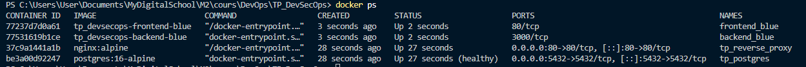

On constate que :

* Le conteneur `postgres` est **healthy**
* Le reverse proxy `nginx` est **running**
* Les services `backend-blue` et `frontend-blue` sont **démarrés**

À ce stade :

* une première version de l’application (blue) est déployée
* l’infrastructure est prête à accueillir une seconde version (green)
* aucune bascule n’est encore configurée côté proxy

⚠️ L’application n’est pas encore accessible via le navigateur car le reverse proxy n’est pas encore configuré.

### Mise en place du reverse proxy Nginx

Un service Nginx est ajouté afin de centraliser l’accès utilisateur et router les requêtes vers la version active de l’application.

Configuration initiale du proxy :
````
server {
    listen 80;

    location / {
        proxy_pass http://backend-blue:3000;

        proxy_set_header Host $host;
        proxy_set_header X-Real-IP $remote_addr;
    }
}
````
Ainsi, le reverse proxy devient le point d’entrée unique de l’application.

#### Test d’accès via le reverse proxy

Après redémarrage du proxy :

docker compose -f docker-compose.base.yml restart reverse-proxy

L’application est accessible via :

http://localhost

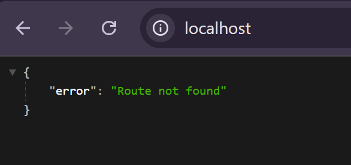

Le backend répond correctement via Nginx (ex : Route not found), ce qui confirme que :

- le reverse proxy fonctionne
- la communication entre conteneurs est correcte
- le routage vers backend-blue est opérationnel

### Dans cette architecture :

les services backend et frontend ne sont plus exposés directement
seul Nginx est accessible via http://localhost

**Cela permet :**

- de centraliser les accès
- de préparer la bascule blue/green
- d’éviter les conflits de ports entre versions

###  Configuration du reverse proxy Nginx

Un reverse proxy Nginx est mis en place afin de centraliser l’accès à l’application et permettre la gestion du déploiement blue/green.

Deux fichiers de configuration sont utilisés :

#### 1. `default.conf`

Ce fichier contient la configuration principale du serveur Nginx :

```nginx
server {
    listen 80;

    location / {
        proxy_pass http://backend;

        proxy_set_header Host $host;
        proxy_set_header X-Real-IP $remote_addr;
    }
}
```

Il définit :

* le point d’entrée (`http://localhost`)
* le routage des requêtes vers un service backend abstrait (`backend`)


#### 2. `active_backend.conf`

Ce fichier permet de définir dynamiquement quelle version de l’application est active.

Exemple (version blue) :

```nginx
upstream backend {
    server backend-blue:3000;
}
```

Ce fichier agit comme un interrupteur entre les versions `backend-blue` & `backend-green`


### Principe de fonctionnement

* Nginx reçoit toutes les requêtes utilisateur
* Il redirige vers un `upstream` nommé `backend`
* L’upstream est défini dans `active_backend.conf`
* Changer ce fichier permet de basculer entre les versions sans redéployer

### Validation

L’application est accessible via http://localhost

Résultat et le même qu'avant :


La réponse du backend confirme que :

* le reverse proxy fonctionne
* la version **blue** est active
* la communication entre conteneurs est opérationnelle

## Déploiement de la version Green

Une seconde version de l’application est déployée en parallèle de la version blue :
````
docker compose -f docker-compose.base.yml -f docker-compose.green.yml up -d
````
Résultat :

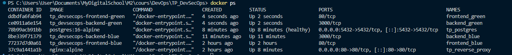


On voit que :

- les services backend-green et frontend-green sont démarrés
- les versions blue et green coexistent
- aucune interruption de service n’est observée

### Bascule vers la version Green

La version active est modifiée via le fichier :
`
nginx/active_backend.conf
`

Puis le reverse proxy est rechargé :

docker exec tp_reverse_proxy nginx -s reload

Résultat :
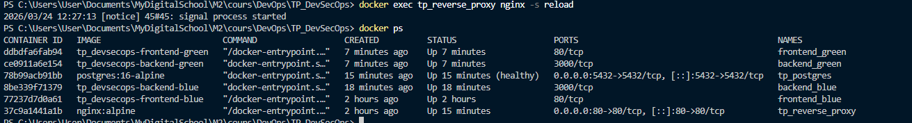

Le signal de reload est pris en compte par Nginx :
````
2026/03/24 12:27:13 [notice] 45#45: signal process started
````
#### Résultat final
- la bascule vers green est instantanée
- aucune reconstruction ou redéploiement n’est nécessaire
- les deux versions peuvent coexister sans conflit
- le rollback est possible à tout moment en modifiant la configuration

Cette approche permet un déploiement sans interruption de service (zero downtime).

## Automatisation du déploiement Blue/Green

Le déploiement blue/green est automatisé via un script PowerShell exécuté par la CI.

### Principe

Un fichier `active_color.txt` permet de stocker la version actuellement active :

```text
blue
```

Le script :

1. lit la couleur active
2. déploie la version opposée
3. met à jour la configuration Nginx
4. recharge le proxy
5. met à jour la couleur active

### Exécution

```bash
powershell ./scripts/blue-green-deploy.ps1
```

#### Intégration CI

Le script est exécuté automatiquement dans le pipeline GitHub Actions sur la branche `main`.

Cette approche permet un déploiement continu sans interruption de service.

----

# TP6 – Monitoring & Observabilité d’une application conteneurisée

## Monitoring – Déploiement de la stack

Une stack de monitoring complète a été déployée afin d’assurer la collecte et la visualisation des métriques et des logs.

### Services déployés

Les services suivants sont lancés via Docker Compose :

* Prometheus : collecte des métriques
* Grafana : visualisation et dashboards
* Loki : stockage des logs
* Promtail : collecte des logs

### Lancement

```bash
docker compose -f docker-compose.monitoring.yml up -d
```

### Accès aux interfaces

* Grafana : http://localhost:3000
* Prometheus : http://localhost:9090

### Réseau

La stack monitoring est connectée au réseau `app-network`, partagé avec l’application, permettant :

* à Prometheus de scraper le backend
* à Promtail d’accéder aux logs Docker

### Vérification

Après lancement :

* tous les conteneurs sont actifs (`docker ps`)
* Grafana est accessible via le navigateur
* Prometheus est accessible et opérationnel

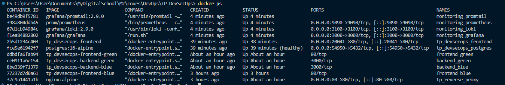
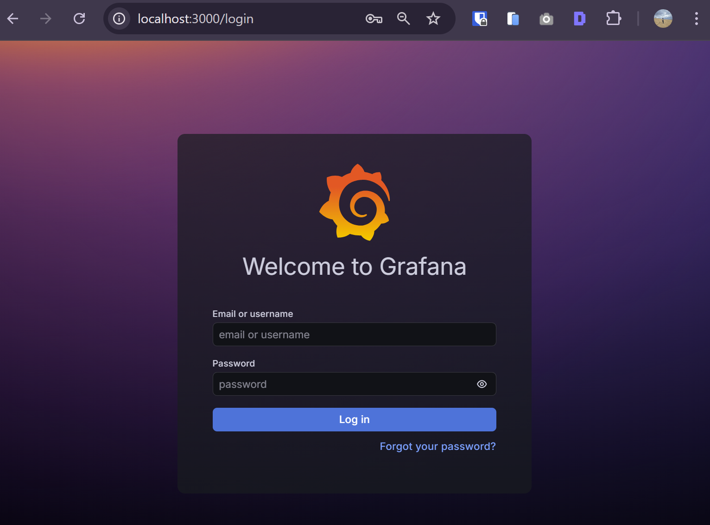
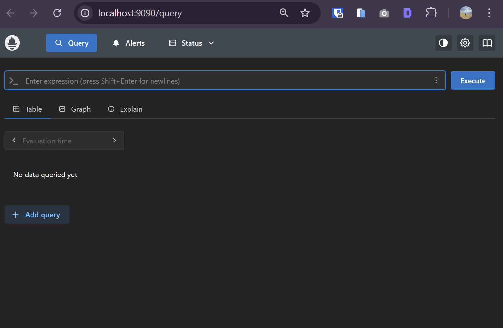

## Collecte des métriques avec Prometheus

Le backend expose un endpoint `/metrics` permettant à Prometheus de collecter les données système.

### Implémentation

Une route a été ajoutée avec la librairie `prom-client` :

```js
const client = require('prom-client');

client.collectDefaultMetrics();

app.get('/metrics', async (req, res) => {
  res.set('Content-Type', client.register.contentType);
  res.end(await client.register.metrics());
});
```

### Configuration Prometheus

Le backend est déclaré comme target dans `prometheus.yml` :

```yaml
scrape_configs:
  - job_name: "backend"
    static_configs:
      - targets: ["backend-blue:3000"]
```

### Vérification

Dans l’interface Prometheus (http://localhost:9090 → Status → Targets) :

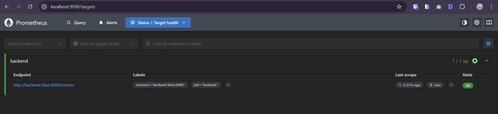

* le service `backend` est détecté
* son état est `UP`
* les métriques sont correctement récupérées

Cette configuration permet d’observer en temps réel les performances du backend (CPU, mémoire, etc.).

Les métriques du backend sont interrogeables via Prometheus et permettent d’observer en temps réel l’utilisation CPU et mémoire du service.
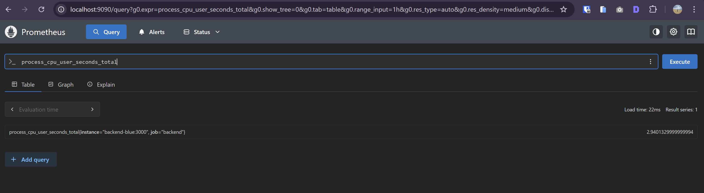

### Collecte des logs avec Loki et Promtail

Les logs de l’application sont collectés et centralisés grâce à Promtail et Loki.

### Principe
- Promtail récupère les logs des conteneurs Docker
- Les logs sont envoyés à Loki
- Grafana interroge Loki pour afficher les logs

### Configuration Promtail

Promtail est configuré pour lire les logs Docker via le socket Docker :
````
scrape_configs:
  - job_name: docker
    docker_sd_configs:
      - host: unix:///var/run/docker.sock

    relabel_configs:
      - source_labels: ['__meta_docker_container_name']
        regex: '/(.*)'
        target_label: 'container'

      - source_labels: ['__meta_docker_container_name']
        target_label: 'job'
````

#### Cette configuration permet de :

- détecter automatiquement les conteneurs
- associer des labels (notamment job=docker)
- envoyer les logs à Loki

### Configuration Loki

Loki est utilisé comme backend de stockage des logs et expose une API interne accessible par Grafana.

### Configuration Grafana

Une datasource Loki a été ajoutée dans Grafana avec l’URL suivante :

http://loki:3100
### Vérification

Dans Grafana, via l’onglet Explore :

- sélection de la datasource Loki
- utilisation de la requête suivante :
`{job="docker"}`

Les logs des conteneurs apparaissent avec :

- timestamp
- niveau (INFO, ERROR)
- message

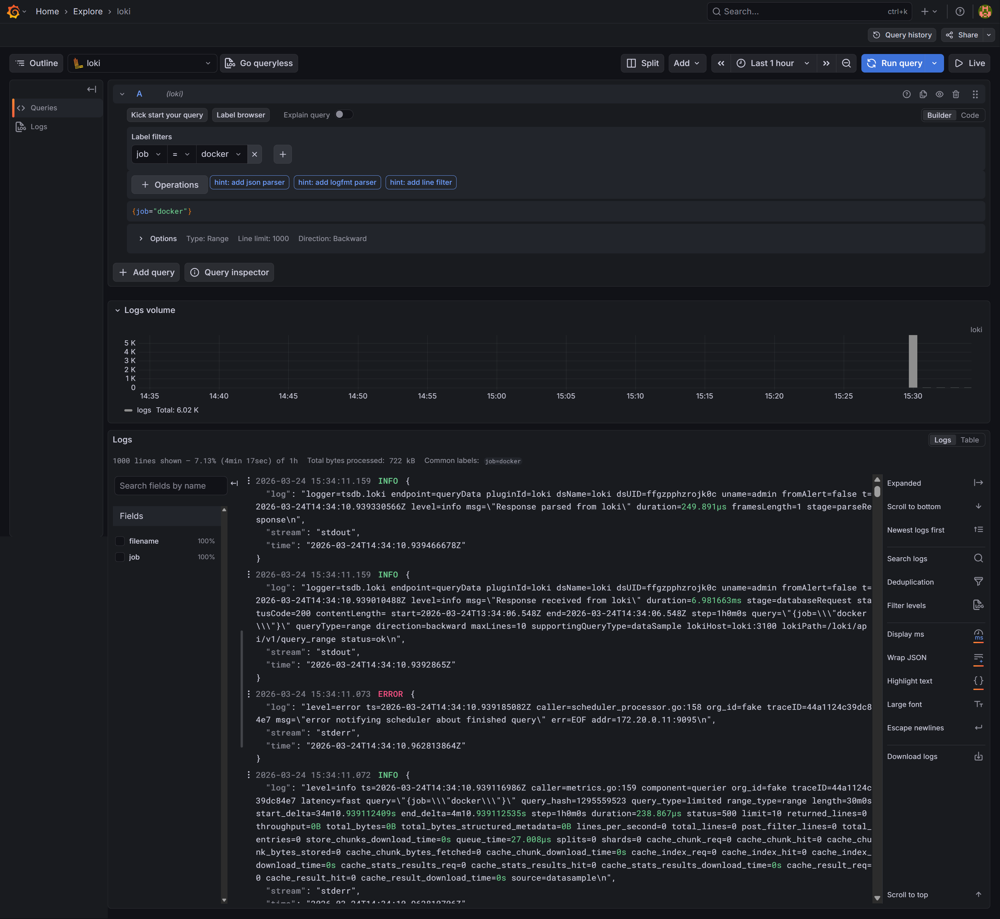

Cette configuration permet de centraliser et d’analyser les logs de tous les services de l’application.

### Conclusion

La stack d’observabilité mise en place permet de couvrir deux piliers essentiels :

* les métriques (Prometheus)
* les logs (Loki + Promtail)

L’application est désormais observable en temps réel, ce qui permet :

- de surveiller les performances
- d’identifier rapidement les erreurs
- de diagnostiquer les problèmes en production

## Visualisation avec Grafana

Un dashboard Grafana a été mis en place afin de visualiser les métriques collectées par Prometheus.

### Configuration

Grafana est connecté à Prometheus comme source de données, permettant d’interroger directement les métriques exposées par le backend.

### Dashboard

Un dashboard personnalisé a été créé avec plusieurs panels représentant les principales métriques système :

- CPU usage
- Memory usage
- Open file descriptors
- Uptime

Chaque panel interroge Prometheus via des requêtes PromQL et affiche les données en temps réel.

Le dashboard permet d’observer en temps réel :

- l’utilisation CPU du backend
- la consommation mémoire
- les ressources système utilisées (descripteurs de fichiers)
- le temps de fonctionnement de l’application

Ces indicateurs facilitent la détection d’anomalies et l’analyse des performances. 

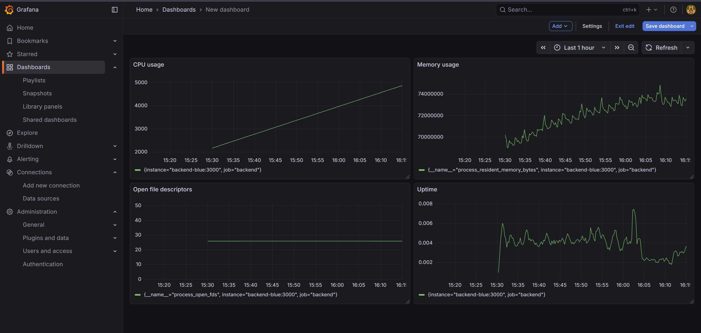
